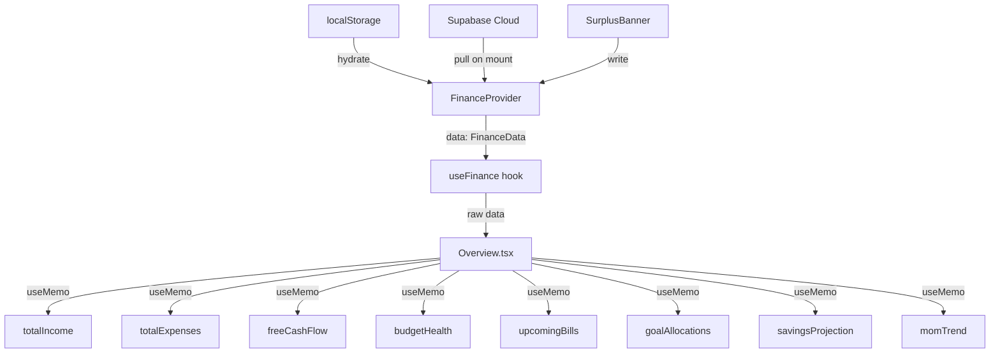

# Overview Tab — Data Layer

## Overview

The Overview tab is **entirely read-only**. It consumes data from the `useFinance()` context hook and derives all displayed values through `useMemo` computations. The only writes it performs are when the user acts on the Surplus Banner (allocating surplus to a goal or savings account).

All financial data ultimately lives in `data: FinanceData`, which is kept in sync between the browser's localStorage and the Supabase `household_finance` table.

---

## Data Sources

```
useFinance()
    └── data: FinanceData
            ├── members[]         → income computation
            ├── expenses[]        → expense totals + budget health + upcoming bills
            ├── accounts[]        → total assets + savings forecast
            ├── goals[]           → goal status (via allocateGoals)
            ├── history[]         → MoM trend, surplus banner trigger
            ├── categoryBudgets   → budget health gauge
            └── emergencyBufferMonths → adjusts liquid savings threshold
```

### `data.members` — Income

Each member has an array of `IncomeSource` objects. The net monthly amount for each source is computed by calling `getNetMonthly(source)` from `taxEstimation.ts`. These are summed across all members and all sources to produce **totalIncome**.

```
totalIncome = Σ getNetMonthly(source)
              for every source in every member
```

`getNetMonthly` applies the full Israeli (or foreign) tax engine if the source is marked as gross; returns the manual override if `useManualNet = true`.

### `data.expenses` — Expenses

Each expense has a `period` field (`'monthly'` or `'yearly'`). Before summing, yearly expenses are normalised to a monthly figure:

```
monthlyAmount(e) = e.period === 'yearly' ? e.amount / 12 : e.amount

totalExpenses = Σ monthlyAmount(e) for all expenses
```

This normalised amount is used everywhere in the Overview tab.

### `data.accounts` — Assets, Contributions, Forecast

- **totalAssets:** `Σ account.balance` across all accounts
- **totalContributions:** `Σ account.monthlyContribution` across all accounts (used in FCF)
- **Savings projection:** compound interest forecast per account (see Computed Values below)

### `data.goals` + `allocateGoals()` — Goal Status

Goal statuses are not stored in the data model — they are computed fresh each render by calling the `allocateGoals` function from `savingsEngine.ts`:

```ts
allocateGoals({
  goals: data.goals,
  monthlySurplus: freeCashFlow,
  accounts: data.accounts,
  emergencyBufferMonths: data.emergencyBufferMonths,
  monthlyExpenses: totalExpenses,
})
```

This returns a list of goal allocations, each with a `status` field (`'realistic' | 'tight' | 'unrealistic' | 'blocked'`).

### `data.history` — Historical Snapshots (MoM Trend + Surplus)

`data.history` is an array of `MonthSnapshot` objects. The Overview tab only uses **non-stub snapshots**, defined as:

```
isStub(snapshot) = snapshot.totalIncome === 0
```

Stubs are months that were auto-created to hold past expense or income entries but have no actual income recorded. They are excluded from trend calculations and from the surplus banner trigger.

### `data.categoryBudgets` — Budget Health Gauge

A partial record mapping `ExpenseCategory → number` (the monthly budget limit for that category). Categories not present in this object have no budget set.

### Yearly Expenses with `dueMonth` — Upcoming Bills

The upcoming bills timeline is built by filtering `data.expenses` for items where `period === 'yearly'` and `dueMonth` is set (1–12).

---

## Computed Values (all in `useMemo`)

### Free Cash Flow

```ts
freeCashFlow = totalIncome - totalExpenses - totalContributions
```

This is the central figure used by the surplus banner, the goal allocation engine, and the FCF KPI card.

### MoM Trend (`momTrend`)

Compares the two most recent non-stub snapshots to compute percentage change in income and expenses:

```ts
pct = ((curr - prev) / prev) * 100
```

Dependencies: `data.history`, `totalIncome`, `totalExpenses`

Returns `null` if fewer than two non-stub snapshots exist (trend pills are hidden in this case).

### Budget Health (`budgetHealth`)

For each expense category that has spending:

```ts
ratio = totalMonthlySpendInCategory / categoryBudgets[category]

if no budget:   status = 'none'
if ratio < 0.8: status = 'under'
if ratio < 1.0: status = 'warning'
else:           status = 'over'
```

The worst offender is the category with the highest ratio that is `'over'`.

Dependencies: `data.expenses`, `data.categoryBudgets`

### Upcoming Bills (`upcomingBills`)

1. Filter expenses: `period === 'yearly' && dueMonth != null`
2. For each, compute the next occurrence date:
   - If `dueMonth >= currentMonth`: next due = current year, `dueMonth`
   - If `dueMonth < currentMonth`: next due = next year, `dueMonth`
3. Filter: next due date is ≤ 6 months from today
4. Sort ascending by next due date

Dependencies: `data.expenses`, current date

### Goal Allocations (`goalAllocations`)

Output of calling `allocateGoals(...)` (see Data Sources above).

Dependencies: `data.goals`, `data.accounts`, `freeCashFlow`, `data.emergencyBufferMonths`, `totalExpenses`

### Savings Projection (`savingsProjection`)

A 13-point array (months 0 through 12) representing projected total savings balance.

Computed per account, then summed:

```ts
// For each account, starting from account.balance:
balance[0] = account.balance
for i in 1..12:
  balance[i] = balance[i-1]
             + account.monthlyContribution
             + (balance[i-1] * account.annualReturnPercent / 100 / 12)

// Sum across all accounts for each month index
projection[i] = Σ accountProjection[i] for all accounts
```

This approach tracks compound interest per account separately, which is more accurate than summing balances first.

Dependencies: `data.accounts`

---

## Writes (Surplus Banner Only)

The Overview tab performs writes only when the user acts on the End-of-Month Surplus Banner.

| Action | Method called | What it updates |
|---|---|---|
| "Add to Goal" | `updateGoal(goalId, { targetAmount })` | Increases a goal's target or records contribution |
| "Add to Savings" | `updateAccount(accountId, { balance })` | Adds surplus to an account's balance |
| Session dismiss | Local React state only | No data change |
| Permanent dismiss | `markSurplusActioned(snapshotDate)` | Flags the snapshot so banner never re-appears |

`markSurplusActioned` stores a flag on the relevant `MonthSnapshot` in `data.history`, preventing the banner from appearing again for that month's surplus — even after a page refresh or on another device.

---

## Stub Detection

A snapshot is classified as a **stub** when:

```ts
snapshot.totalIncome === 0
```

Stubs are excluded from:
- MoM trend calculation
- Surplus banner trigger check
- Any average or aggregation over history

This prevents months that were auto-created for historical expense entry (but have no income recorded yet) from skewing trend arrows or falsely triggering the surplus banner.

---

## Data Flow Diagram



---

## Dependency Table

| Displayed value | Source fields | Computation |
|---|---|---|
| Monthly Income | `members[].sources[]` | `Σ getNetMonthly(source)` |
| Monthly Expenses | `expenses[]` | `Σ amount ÷ 12 (if yearly)` |
| Free Cash Flow | All three above | `income - expenses - contributions` |
| Total Assets | `accounts[].balance` | Sum |
| Budget Health | `expenses[]`, `categoryBudgets` | Per-category ratio + classification |
| Upcoming Bills | `expenses[]` where `period=yearly` | Next due date, filter ≤ 6 mo |
| Goal Status | `goals[]`, `accounts[]`, FCF | `allocateGoals()` |
| Savings Forecast | `accounts[]` | Compound interest per account |
| MoM Trend | `history[]` (non-stub) | `(curr-prev)/prev * 100` |
| Surplus Banner | `history[]` (last non-stub, FCF > 0) | Trigger + dismiss flag |
